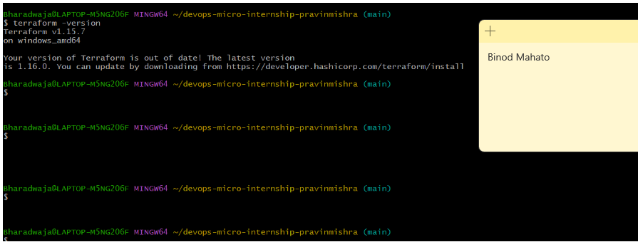
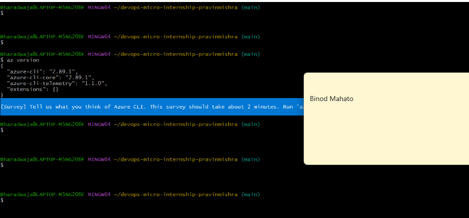
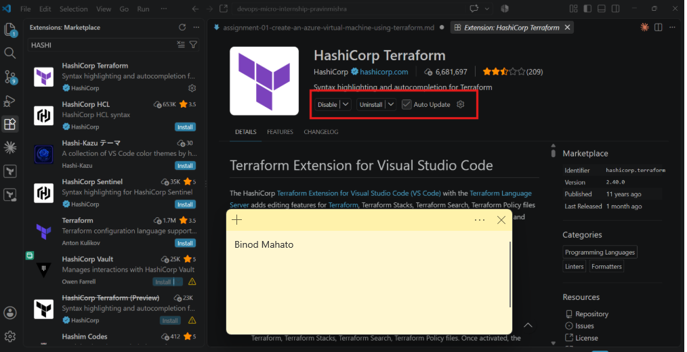
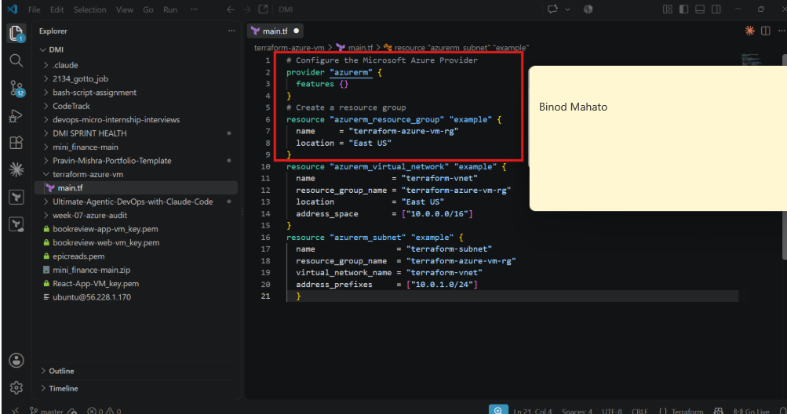
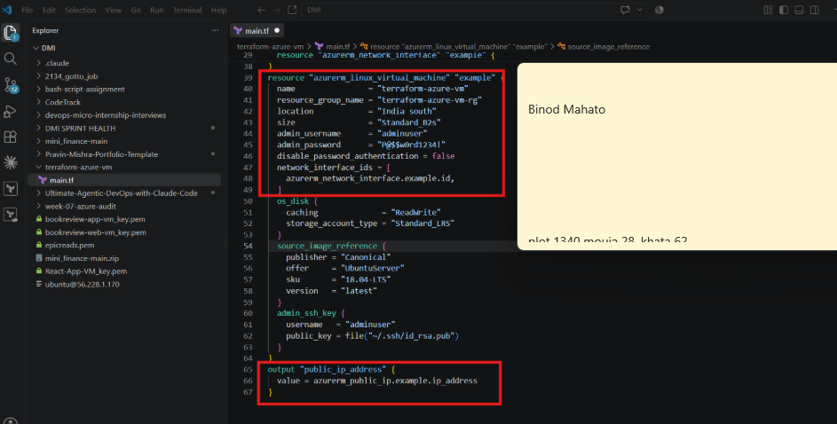
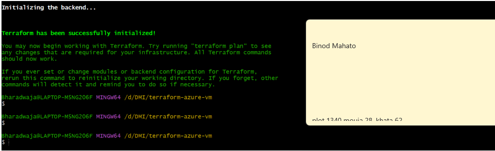
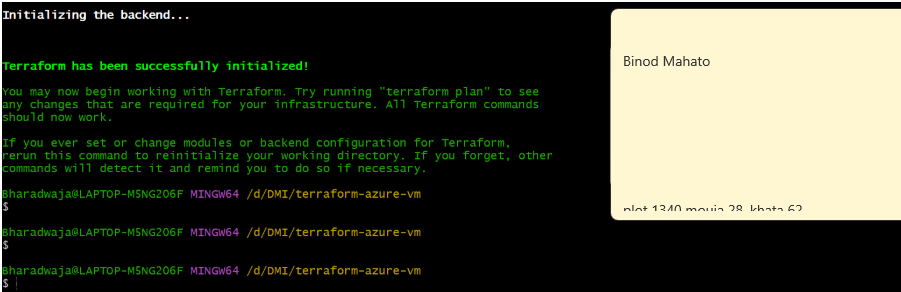
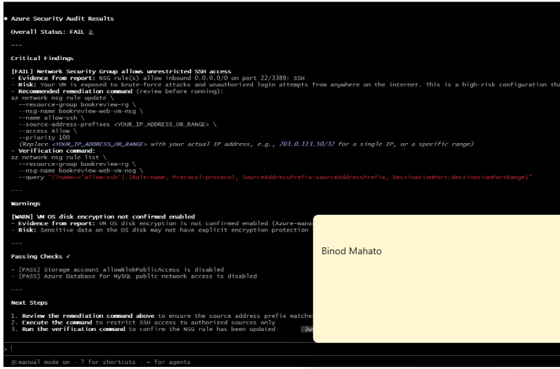
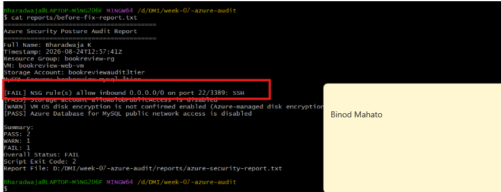

# Assignment 1 — Create an Azure Virtual Machine using Terraform

Part of the DevOps Micro Internship (DMI) Cohort 3 with Agentic AI

---

## Purpose

In this assignment, you will use Terraform to provision a complete Azure Virtual Machine environment: a resource group, virtual network, subnet, public IP, network interface, and an Ubuntu 18.04 Linux VM. You will initialize, plan, and apply the configuration, verify the running VM via Azure CLI, and destroy the resources after testing.

---

# Task 1 — Create a New Terraform Project and Define the Infrastructure

## Goal

Create a `terraform-azure-vm` project and define the resource group, virtual network, subnet, public IP, network interface, and Ubuntu 18.04 VM (with username/password authentication and a public IP output) in `main.tf`.

### Evidence

#### Screenshot 1 — VS Code showing `main.tf` and the required Azure resources

---

#### Screenshot 2 — `main.tf` showing the public IP output and VM authentication configuration, with the password hidden or redacted

---

# Task 2 — Initialize Terraform

## Goal

Run `terraform init` and confirm the working directory initializes successfully.

### Evidence

#### Screenshot 3 — Terminal showing successful `terraform init` output

---

# Task 3 — Plan and Apply the Configuration

## Goal

Review `terraform plan`, run `terraform apply`, and record the VM's public IP from the Terraform output.

### Evidence

#### Screenshot 4 — Terraform plan summary showing the proposed resources

---

#### Screenshot 5 — Terraform apply output showing successful completion

---

#### Screenshot 6 — Terraform output showing the public IP of the VM

---

# Task 4 — Verify the Deployment

## Goal

Use Azure CLI to confirm the VM was created and is running.

### Evidence

#### Screenshot 7 — Azure CLI output showing the VM name and running status

---

# Task 5 — Destroy the Resources

## Goal

Run `terraform destroy` to clean up the Azure resources after testing.

### Evidence

#### Screenshot 8 — Terminal showing successful `terraform destroy` completion

---

### Notes

Write a short paragraph explaining what you learned or any issues you encountered.

Compare this assignment to the AWS audit you built in Week 6: which finding categories map to each other across the two clouds, and what stayed exactly the same about the workflow even though the az/aws commands are completely different?

The finding categories are essentially the same across AWS and Azure, even though the services and CLI commands differ. In AWS, the audit looked for security-group rules exposing SSH/RDP, public access to S3, encryption-related issues, and public access to RDS. In Azure, the equivalent checks are NSG rules exposing SSH/RDP, Storage Account blob public access, VM disk-encryption status, and Azure Database for MySQL public network access. The cloud-specific resources change, but the underlying security questions remain: who can reach the resource, is data publicly exposed, and is data protected at rest.

What stayed exactly the same was the engineering workflow: Gather → Analyze → Human Act → Verify. Bash collects deterministic evidence, Claude/Agentic AI analyzes that evidence and recommends a remediation, the human reviews and executes the change, and the audit is run again to prove the finding is resolved. The aws and az commands are different, but the safety model, read-only audit, human approval, evidence-before-fix, and before/after verification remain the same.

---

# Submission Instructions

- Add all required screenshots in your submission
- Include the VM public IP from the Terraform output
- Do not expose Azure credentials, subscription details, or passwords

---

# Completion Checklist

- [ ] Task 1: `terraform-azure-vm` project created with all required resources defined (Screenshots 1–2)
- [ ] Task 2: `terraform init` completed successfully (Screenshot 3)
- [ ] Task 3: Plan reviewed and `terraform apply` completed, public IP recorded (Screenshots 4–6)
- [ ] Task 4: VM verified as running via Azure CLI (Screenshot 7)
- [ ] Task 5: `terraform destroy` completed successfully (Screenshot 8)
- [ ] Learning/issues paragraph written (Notes)
- [ ] No sensitive information exposed

---

## 📌 About DMI & CloudAdvisory

DevOps Micro Internship (DMI) is a project-based DevOps program run by Pravin Mishra (The CloudAdvisory) focused on real-world execution, systems thinking, and career readiness.

It helps learners build strong DevOps foundations with hands-on experience.

---

## 📌 Resources

- 🌐 DMI Official Website: https://dmi.pravinmishra.com?utm_source=github&utm_medium=readme  
- 🎓 University: https://university.pravinmishra.com?utm_source=github&utm_medium=readme  
- 💬 Discord Community: https://discord.pravinmishra.com?utm_source=github&utm_medium=readme  
- 📝 Blog: https://dmi.pravinmishra.com/blog?utm_source=github&utm_medium=readme  
- ▶️ YouTube Playlist: https://www.youtube.com/playlist?list=PLFeSNDtI4Cho  
- 🔗 Pravin Mishra (LinkedIn): https://www.linkedin.com/in/pravin-mishra-aws-trainer/  
- 🏢 CloudAdvisory (LinkedIn): https://www.linkedin.com/company/thecloudadvisory/

---

*This submission is part of DevOps Micro Internship (DMI) Cohort 3 — Agentic AI Track.*
